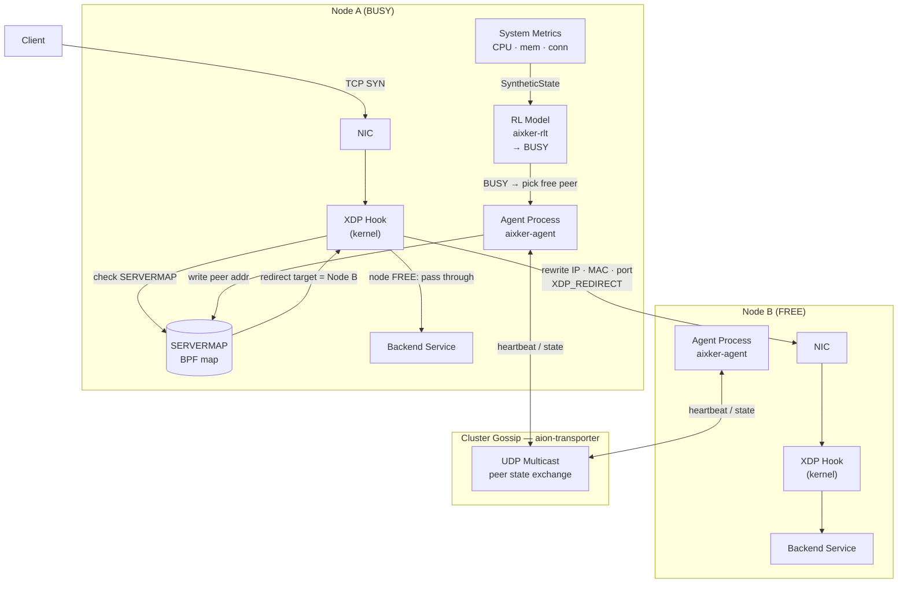

# AIxKer


A distributed AI-driven L4 load balancer written in Rust. Runs a reinforcement-learning agent on each node alongside an eBPF/XDP kernel-bypass NAT engine.

**routing decisions happen inside the kernel before the TCP stack sees each packet.**

## How it works

Each node runs one agent process. The RL model (`aixker_rlt`) reads system metrics and decides when the local node is overloaded (`BUSY`). When busy, the agent picks a free peer from the cluster, writes that peer's address into the `SERVERMAP` BPF map, and the XDP program starts redirecting all new TCP SYNs directly to that peer at NIC level — no userspace, no socket buffers.

Peers discover each other via UDP multicast gossip (`aion_transporter`). No central registry, no single point of failure.



## Benchmarks

Load profile: 100 → 32,000 req/s over 3 minutes (k6 ramping-arrival-rate), no think time.

**Test setup:** 10 machines each running a Go HTTP backend. nginx, haproxy, envoy, and kong are each deployed as a single proxy node in front of all 10 backends, load balancing across them in the traditional way. aixker runs differently — one agent is co-located on each of those same 10 backend machines, forming a self-organizing cluster with no separate proxy node.

| Target | Throughput | p95 latency | Avg latency | Failures |
|---|---|---|---|---|
| **aixker** (10 agents, embedded) | **4,700 req/s** | **91.5 ms** | **23.4 ms** | **0.00%** |
| nginx (1 proxy → 10 backends) | 1,622 req/s | 1,390 ms | 887 ms | 4.94% |
| haproxy (1 proxy → 10 backends) | 1,329 req/s | 1,040 ms | 704 ms | 9.79% |
| envoy (1 proxy → 10 backends) | 1,388 req/s | ~60,000 ms ⚠ | 3,300 ms | 6.77% |
| kong (1 proxy → 10 backends) | 2,631 req/s | 1,600 ms | 479 ms | 75.67% ⚠ |

aixker delivers **2.9× nginx throughput** and **zero failures** across all 5 runs. Every other system dropped 5–76% of requests at peak load. Kong's apparent throughput is misleading — 75% of those "fast" responses are immediate rejections.

## Architecture

```
AION-Agent/
├── agent/src/main.rs           — agent core: gossip, AI loop, SERVERMAP manager, eBPF loader
├── agent/src/metrics.rs        — system metrics → AI input (SyntheticState)
├── agent/src/configurations.rs — config.toml loader
├── agent/src/libebpf.so        — compiled eBPF object (embedded at build time)
└── agent/config.toml           — runtime config (interval_secs, mode)

AION-EBPF/
└── ebpf/src/lib.rs             — XDP program: NAT engine, SYN handler, checksum rewrite
```

### BPF maps

| Map | Purpose |
|---|---|
| `SERVERMAP` | Current redirect target (IP + MAC) |
| `NAT_MAP` | Per-connection 5-tuple NAT state (10,240 entries) |
| `DEVMAP` | NIC index for `XDP_REDIRECT` |
| `BLOCKLIST` | Dropped source IPs |
| `PORT_COUNTER` | Per-CPU ephemeral port counter (lock-free) |

## Quick start

```bash
git clone https://github.com/ali-heidari/AION-Agent.git
cd AION-Agent
cargo build --release

# requires CAP_BPF + CAP_NET_ADMIN + CAP_SYS_ADMIN
sudo ./target/release/agent

# seed a known neighbor
sudo ./target/release/agent -- neighbor 192.168.100.62

# force busy mode (always redirects)
sudo ./target/release/agent -- busy
```

### Run 10 containerized agents + monitoring

```bash
sudo docker compose -f dashboard/docker-compose.yml -f agent/docker-compose.yml up -d
```

### Benchmark

```bash
# aixker
k6 run test/k6-v2.js

# nginx / haproxy / envoy / kong
k6 run --env TARGET=nginx    test/k6-v2.js
k6 run --env TARGET=haproxy  test/k6-v2.js
k6 run --env TARGET=envoy    test/k6-v2.js
k6 run --env TARGET=kong     test/k6-v2.js
```

## Requirements

- Linux kernel ≥ 5.4
- `CAP_BPF`, `CAP_NET_ADMIN`, `CAP_SYS_ADMIN`
- For containers: `privileged: true` + `network_mode: host`

## Recommended two-tier deployment

```
Internet
    ↓
nginx / haproxy   — SSL termination, L7 routing, WAF
    ↓
aixker cluster    — L4 high-throughput distribution, AI-driven, no SPOF
    ↓
Backend services
```

## Standards

This project follows [`ai-agent-standards`](https://github.com/ali-heidari/ai-agent-standards). See [`.agent/agent-instructions.md`](.agent/agent-instructions.md) for project-specific AI agent guidance.

## Contributing

Contributions are welcome. Please open issues or pull requests.

## Donations

Support this project: [Open Collective](https://opencollective.com/aixkernel)

## AIxKer Projects

| Project | Role |
| --- | --- |
| [aixker-rlt](https://github.com/ali-heidari/aixker-rlt) | Reinforcement-learning model — classifies node state (`FREE`/`BUSY`) and selects redirect targets |
| [aion-transporter](https://github.com/ali-heidari/aion-transporter) | UDP multicast gossip layer — peer discovery and cluster membership with no central registry |
| [aion-math](https://github.com/ali-heidari/aion-math) | Lightweight math utilities used by the RL agent for metric normalization and scoring |
| [AION-EBPF](https://github.com/ali-heidari/AION-EBPF) | XDP/eBPF kernel program — NAT engine, SYN handler, and checksum rewrite running at NIC level |

## License

This project is licensed under the terms in the [LICENSE](LICENSE) file.
